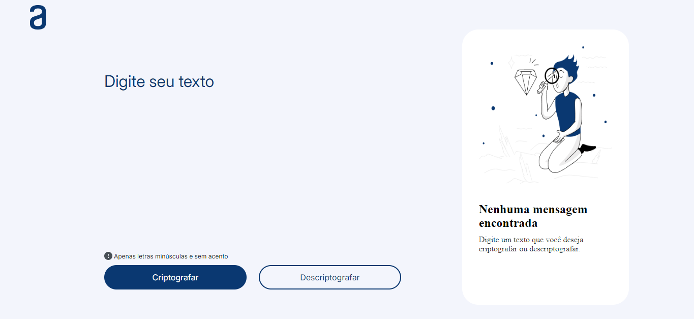
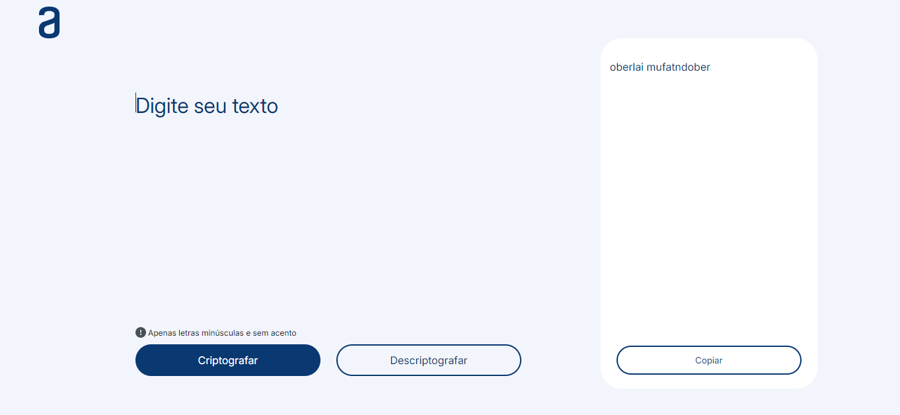
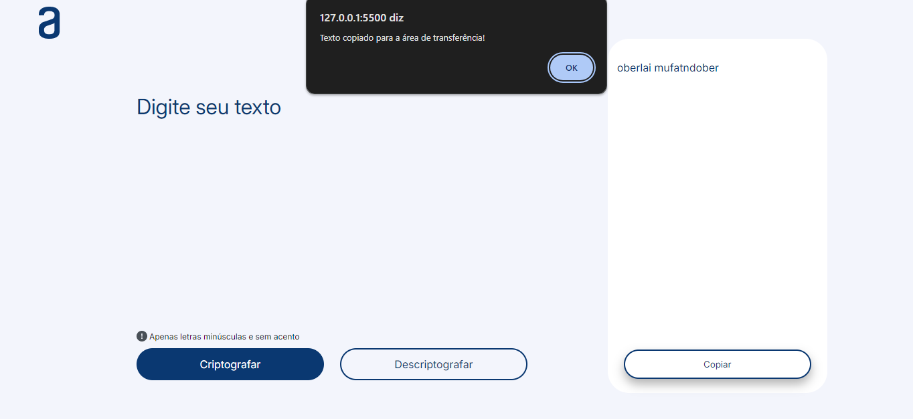

# Decodificador de Texto

Este é um simples decodificador de texto que criptografa e descriptografa mensagens utilizando uma substituição de caracteres personalizada. O projeto foi desenvolvido como uma prática de JavaScript, HTML e CSS.

### Tela Inicial



## Funcionalidades

- **Criptografia de Texto:** Transforma seu texto em uma mensagem criptografada utilizando as regras definidas.
  
  

- **Descriptografia de Texto:** Converte uma mensagem criptografada de volta ao texto original.
  


- **Copiar Texto:** Permite copiar o resultado para a área de transferência com um único clique.
  


- **Limpeza Automática:** O conteúdo da área de texto é automaticamente limpo após a criptografia ou descriptografia.

## Tecnologias Utilizadas

- **HTML5**
- **CSS3**
- **JavaScript**

## Chave de Criptografia

- A letra "e" é convertida para "enter"
- A letra "i" é convertida para "imes"
- A letra "a" é convertida para "ai"
- A letra "o" é convertida para "ober"
- A letra "u" é convertida para "ufat"

## Requisitos:

- Deve funcionar apenas com letras minúsculas
- Não devem ser utilizados letras com acentos nem caracteres especiais

## Como Executar Localmente

1. Clone este repositório:
   ```bash
   git clone https://github.com/seu-usuario/nome-do-repositorio.git

2. Navegue até o diretório do projeto:
   ```bash
   cd nome-do-repositorio

3. Abra o arquivo index.html no seu navegador de preferência.

## Contribuições

Contribuições são bem-vindas! Sinta-se à vontade para abrir uma issue ou enviar um pull request.

## Devolvido por Ellen Rocha
